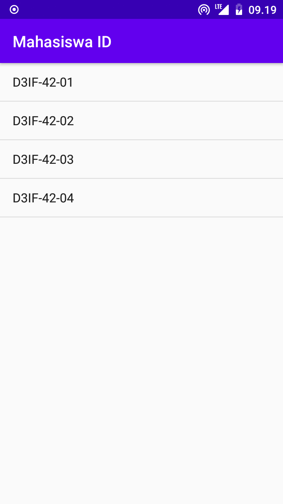
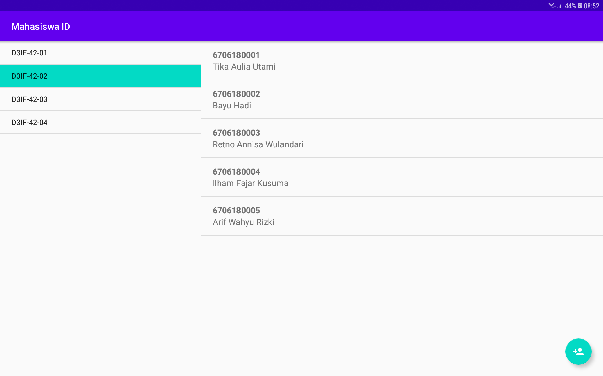

# Mahasiswa ID

Aplikasi Android yang menampilkan data mahasiswa dalam bentuk daftar. Menggunakan custom dialog untuk input data dan action mode agar dapat menghapus banyak data sekaligus.

Aplikasi ini menggunakan navigasi master-detail yang diimplementasikan dengan Navigation Component. Di smartphone, tampilan aplikasi seperti berikut:

Tampilan Kelas                                    | Tampilan Data
--------------------------------------------------|------------------------------------------------------
|

Jika aplikasi dijalankan di tablet, tampilan akan menyesuaikan dengan two-pane layout seperti ini:

Tampilan Kelas dan Data
-------------------------------------------------|
|

Punya pertanyaan atau masukan? Silahkan disampaikan melalui issue repository ini.

## Lisensi

Copyright (c) 2020 Indra Azimi. All rights reserved.

Dibuat untuk kelas Pemrograman untuk Perangkat Bergerak 2. Dilarang melakukan penggandaan dan atau komersialisasi, sebagian atau seluruh bagian, baik cetak maupun elektronik terhadap project ini tanpa izin pemilik hak cipta.
